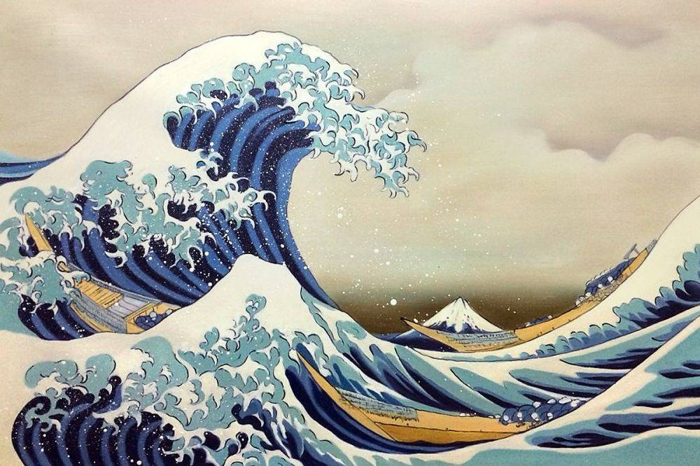

# Low Poly Compression
This is an investigative work that sees if converting all the frames in a video into low poly frames improves compression in native H.264. An extension to this will create a custom encoding algorithm that compresses low poly frames and benchmarks that against the native H.264 compression.

To generate low poly art pictures run:
```
python3 gen_vid.py wave.jpg 15000
```

Replace the first argument with the file name and the second with the number of vertices you want there to be in the image.

Some samples are given below. All of the following poly images have been constructed using 15000 vertices.

Obama


Bliss


The Great Wave off Kanagawa


